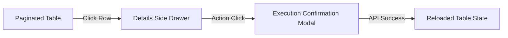

# ZeTime Dashboard Information Architecture

This document defines the structural map and page hierarchy of the ZeTime Enterprise Admin Dashboard, establishing the navigation paths, layout layouts, and user interactions.

---

## 🗺️ 1. Complete Information Architecture Map

```mermaid
graph TD
    Root[Admin Dashboard] --> Login[1. Security Login]
    Root --> TopBar[2. Global Header]
    Root --> Sidebar[3. Side Navigation]
    Root --> BodyCanvas[4. Core Page Canvas]

    TopBar --> Search[Global Search Bar]
    TopBar --> Alerts[Live Alerts Notification Bell]
    TopBar --> UserProfile[User Profile Options]

    Sidebar --> Overview[Overview Hub]
    Sidebar --> CoreUsers[User Directory]
    Sidebar --> MerchantPortal[Merchant Center]
    Sidebar --> ServiceModules[Service Modules Control]
    Sidebar --> FinOps[Financial Operations]
    Sidebar --> GrowthMarketing[Growth & Promos]
    Sidebar --> SupportOps[Support Desk]
    Sidebar --> ConfigSettings[Config & Gateway Settings]

    BodyCanvas --> OverviewHub[Overview Hub Page]
    BodyCanvas --> UsersList[Customer Directory View]
    BodyCanvas --> ProvidersList[Merchant Center List]
    BodyCanvas --> PropertyControl[Rental Properties Management]
    BodyCanvas --> RestControl[Restaurants floorplan Editor]
    BodyCanvas --> DeliveryControl[Delivery Drivers Fleet]
    BodyCanvas --> AssistanceControl[Street Assistance Control]
    BodyCanvas --> LedgerControl[Financial Settlements Page]
    BodyCanvas --> MarketingControl[Coupons & Marketers Panel]
    BodyCanvas --> ChatControl[Unified Ticket Chat Screen]
    BodyCanvas --> SystemSettingsPage[System Settings Canvas]
```

---

## 📐 2. Structural Canvas Grids

The admin interface utilizes a modern 3-pane responsive layout:
1. **Sidebar Column (Left - 260px Fixed Width)**: Collapsible sidebar housing hierarchical list items.
2. **Global Top Navigation (Top - 70px Fixed Height)**: Hosts search bar, system health indicator, pending tasks alert bell, and active profile controls.
3. **Main Workspace Canvas (Center-Right - Fluid Flex Box)**: Displays the main tables, filters header, charts, and interactive maps.

---

## 🔄 3. Operational Flows & Page Trees

All list screens follow this interaction cycle to prevent page reloading, leveraging a unified component structure.
