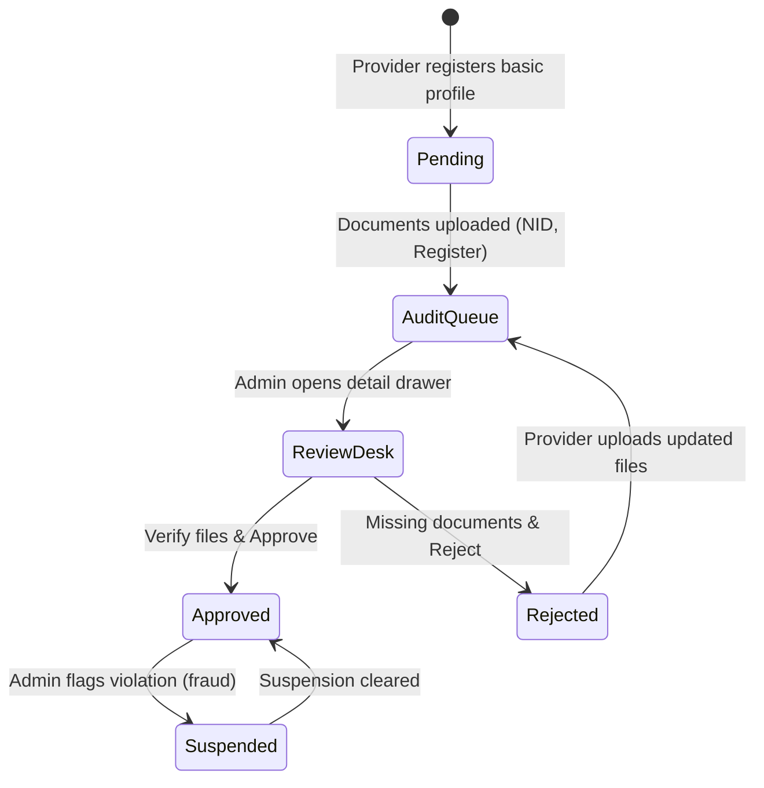
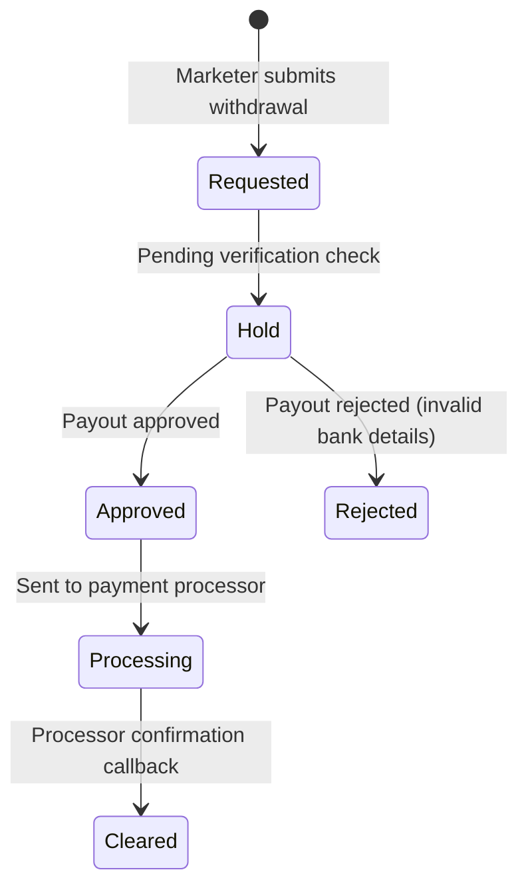
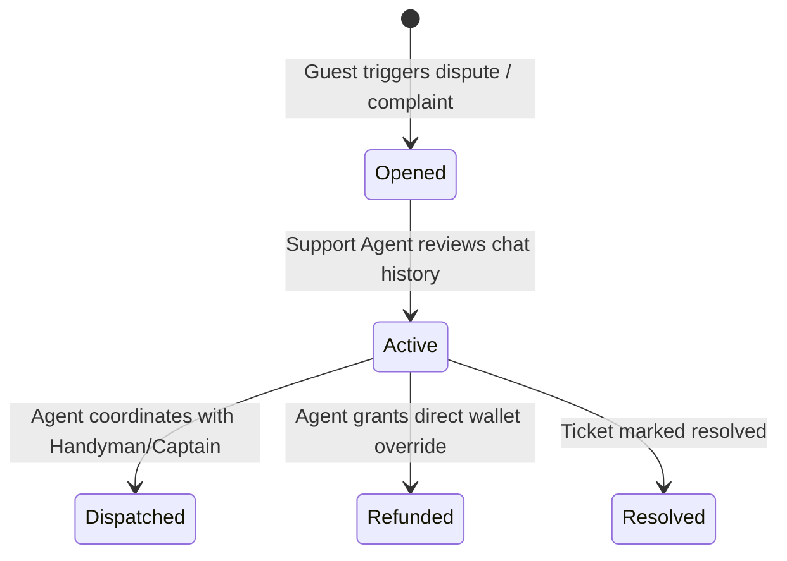

# Admin Dashboard Operational Workflows

This document outlines the state transitions and manual overrides executed by administrators from the dashboard.

---

## 🏢 1. Merchant Onboarding Verification Workflow

---

## 💸 2. Marketer Payout (Withdrawals) Workflow

### Business Rules (Marketer Payouts)
* Withdrawals can only be requested if available marketer balance ($B$) is greater than or equal to the requested amount ($W$):
  $$B \ge W$$
* Upon rejection, the requested amount must be instantly refunded to the marketer's ledger account:
  $$B_{\text{new}} = B_{\text{old}} + W$$

---

## 🚨 3. Support Incident & Dispute Override Workflow

### Manual Booking Status Override
If a provider fails to mark a service completed or customer disputes completion:
1. Support Manager can manually override status to `completed` or `cancelled`.
2. Logging: System generates a `BookingLog` record:
   * `action` = `manual_status_override`
   * `reason` = Agent's audit explanation
   * `action_by_id` = Admin ID.
